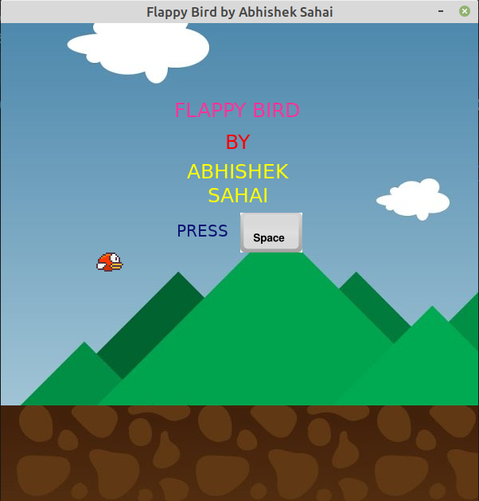
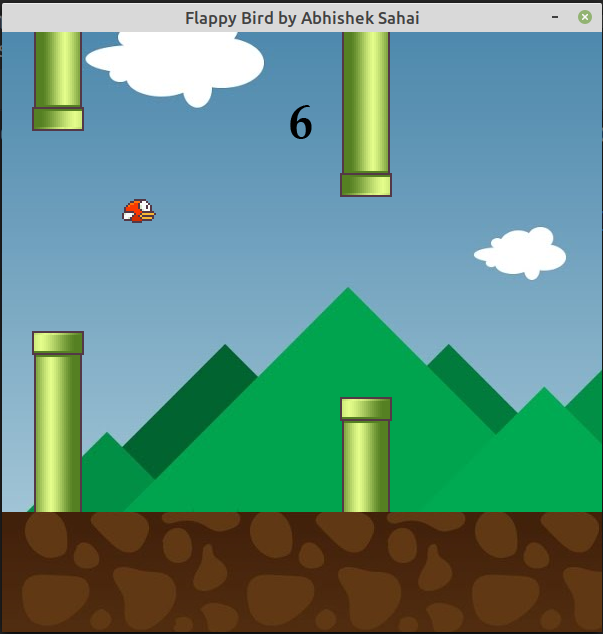
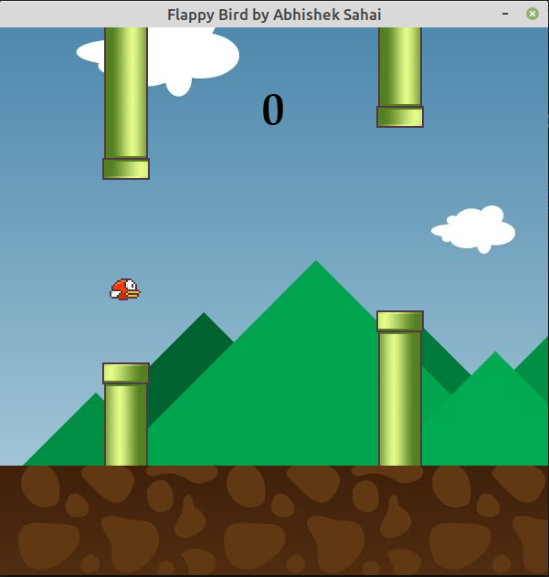

# Flappy_Bird_Game
This is a game built completely in Python with the help of Pygame Library.  
It is a basic model. The offset variable can be altered to increase the difficulty of the game. 

# 1.Welcome Screen

# 2.Inside the game

